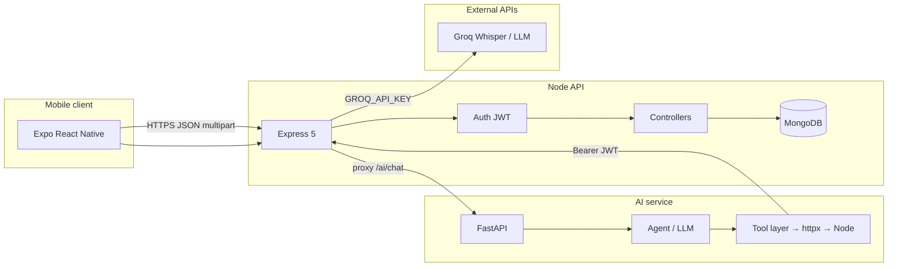

# Campus ERP / DevOops — Technical Context

This document describes the **architecture**, **major components**, **data model**, **API surface**, and **operational** aspects of the application as implemented in this repository. It is intended for engineers onboarding to the codebase or integrating adjacent systems.

---

## 1. Product scope (what the system does)

A **campus operations** style product delivered primarily as a **mobile app** (Expo / React Native) backed by a **Node.js + MongoDB** API, with an optional **Python FastAPI** service for **LLM copilot**, **request parsing**, **tagging**, and **tool calls** that reach back into the Node API using the user’s JWT.

Rough feature areas reflected in code:

| Domain | Examples in codebase |
|--------|----------------------|
| Identity | Register, login, JWT, roles |
| Scheduling | Personal / room schedules, audience targeting |
| Approvals | Multi-step approval requests (leave, room, LOR, etc.) |
| Attendance | Course-linked sessions, faculty mark, student overview |
| Notifications | User notifications, announcements |
| Issues | Report / track issues |
| Materials | Upload / list teaching materials |
| Payments / fines | Payment records, admin-imposed fines |
| AI assistant | Chat, attachments, voice transcription proxy, agent tools |

---

## 2. High-level architecture

**Request paths:**

1. **Normal app traffic** — React Native → `API_BASE` (Node, port **6969** by default) → MongoDB.
2. **AI chat** — App → Node `POST /ai/chat` (protected) → FastAPI `POST /api/copilot/agent` with **user JWT** → agent may call Node via `node_client.py` with the same token.
3. **Speech-to-text** — App → Node `POST /ai/transcribe` (multipart `audio`) → Groq OpenAI-compatible transcription (configured on Node via `GROQ_API_KEY`).

---

## 3. Repository layout

| Path | Role |
|------|------|
| `frontend/` | Expo SDK ~54, React 19, React Native 0.81, **expo-router** file-based routes, screens under `src/screens/`, shared UI under `src/components/`, theme under `src/theme/`. |
| `backend/` | **ESM** Node app: Express 5, Mongoose 9, JWT + bcrypt, Multer uploads, `MONGO_URI`. |
| `ai_services/` | FastAPI app: copilot agent, request/tag routers, Mongo read for context, **httpx** calls to Node. |

Root `README.md` is minimal; this file is the **system-level** technical overview.

---

## 4. Backend (Node / Express)

### 4.1 Runtime & configuration

- **Module system:** `"type": "module"` — imports use `.js` extensions in imports as per Node ESM convention in this project.
- **Port:** `process.env.PORT || 6969`, listens on `0.0.0.0`.
- **Database:** `mongoose.connect(process.env.MONGO_URI)` in `config/database.js` (started after server listen).
- **CORS:** `origin: true`, `credentials: true` (permissive; tighten for production).

### 4.2 Authentication & authorization

- **`middleware/authMiddleware.js`**
  - **`protect`:** JWT from `Cookie: jwt` **or** `Authorization: Bearer <token>` → loads `User` into `req.user`.
  - **`authorize(...roles)`:** Role gate for routes.

- **Auth:** `controllers/authController.js` — issues JWT (`jsonwebtoken`) with `{ id, role }`, sets httpOnly cookie **and** returns `token` in JSON for mobile.

- **User roles (enum on `User`):** `student`, `faculty`, `hod`, `principal`, `admin`, `support`, `club`.

### 4.3 HTTP route map (`backend/index.js`)

| Mount | Router file | Purpose |
|-------|-------------|---------|
| `/auth` | `routes/auth.js` | Register, login |
| `/prof` | `routes/professor.js` | Professor profiles |
| `/request` | `routes/request.js` | Approval requests, actions, pending list, approvers |
| `/schedule` | `routes/schedule.js` | Schedules (create, my list, slots, etc.) |
| `/attendance` | `routes/attendance.js` | Overview, mark, course history, faculty stats |
| `/notifications` | `routes/notification.js` | User notifications, announcements |
| `/issues` | `routes/issue.js` | Issue reporting / listing |
| `/materials` | `routes/material.js` | Material uploads / listing |
| `/uploads` | static | Serves `uploads/` (e.g. documents) |
| `/ai` | `routes/ai.js` | Chat proxy, transcribe, document upload for AI |
| `/fines` | `routes/fine.js` | Admin/principal impose fine (creates `Payment` + notification) |
| `/courses` | `routes/course.js` | Courses for attendance UI, roster search |

### 4.4 Mongoose models (conceptual)

| Model | File | Notes |
|-------|------|-------|
| `User` | `models/User.js` | Core identity; `department`, `rollNumber`, `employeeId`, `copilotContext`, FCM tokens |
| `Department` | `models/Department.js` | `hod`, `principal` refs |
| `Course` | `models/Course.js` | `code`, `name`, `faculty`, `department`, `enrolledStudents[]` |
| `Schedule` | `models/Schedule.js` | Events: rooms, audience, course link, clash metadata |
| `Attendance` | `models/Attendance.js` | Per course + UTC calendar `date`, `records[]` with `student` + `status` enum |
| `ApprovalRequest` | `models/ApprovalRequest.js` | Typed requests, `steps[]` workflow, `currentStep`, `overallStatus` |
| `Payment` | `models/Payment.js` | Fees/fines; `type` enum includes `library_fine`, `other`, etc. |
| `Notification` | `models/Notification.js` | In-app notifications + optional `refModel` / `refId` |
| `Issue` | `models/Issue.js` | Support / facility issues |
| `ProfessorProfile` | `models/ProfessorProfile.js` | Faculty academic metadata (used in smart routing for some request types) |
| `ChatMessage` / `Plugin` | `models/*.js` | Present for extensibility / chat |

**Notable backend patterns:**

- **Approval requests** — `requestController.js` shapes JSON for clients (`shapeApprovalRequestForClient`) so `ObjectId` / populated refs serialize predictably for React Native.
- **Attendance** — `getAttendanceOverview` separates **student** vs **faculty/hod** logic; avoids treating schedule audience as substitute attendance; `POST /attendance/mark` validates course ownership (or HOD department / admin), student ids, and normalizes **UTC day** for idempotency.
- **Fines** — `POST /fines` resolves student by Mongo id / email / roll number; verifies name match; creates `Payment` + `Notification`.

### 4.5 Seeding

- **`backend/seed_user.js`** — Demo student, payments, **CSE department**, **faculty**, and curriculum courses (**CS301** DAA, **CS302** CCN, **CS303** OS), enrolls seed student.
- **`npm run seed`** in `backend/` runs `node seed_user.js`.

---

## 5. Frontend (Expo / React Native)

### 5.1 Entry & navigation

- **Expo Router** — routes live under `frontend/app/*.js`; each file default-exports a screen or re-exports a component from `src/screens/`.
- **Root layout** — `app/_layout.js` wraps the stack in `GestureHandlerRootView` (gesture + Reanimated friendly).

### 5.2 API client

- **`src/config/api.js`** exports `API_BASE`.
  - Uses `EXPO_PUBLIC_API_BASE` when set.
  - In dev, infers host from Expo `Constants` (`hostUri` / `debuggerHost`); falls back to a LAN IP constant if localhost.
  - **Implication:** physical devices must reach the machine running Node; `.env` override is the reliable fix when LAN detection fails.

### 5.3 Auth persistence

- **`@react-native-async-storage/async-storage`** stores `token` and `user` JSON post-login; screens attach `Authorization: Bearer` for API calls.

### 5.4 Representative screens (`src/screens/`)

| Screen | Role / feature |
|--------|----------------|
| `LoginScreen` / `RegisterScreen` / `RoleSelectionScreen` | Onboarding |
| `StudentDashboard` | Schedule, attendance ring, announcements, tasks, AI shortcut |
| `FacultyDashboard` | Attendance overview, approvals, mark-attendance entry |
| `AdminDashboard` | Metrics-style cards, fines, approvals |
| `ScheduleScreen` | Calendar / timeline |
| `ApprovalsScreen` | Pending approvals, approve/reject |
| `MakeRequestScreen` | Create approval requests |
| `MarkAttendanceScreen` | Course chips, date, roster + search, `POST /attendance/mark` |
| `AIAssistantScreen` | Chat UI, history, attachments, recording → transcribe |
| `ProfileScreen`, `NotificationsScreen`, `UploadMaterialScreen`, `ReportIssueScreen`, `BookSpaceScreen`, etc. | Satellite features |

---

## 6. AI services (Python / FastAPI)

### 6.1 App entry

- **`ai_services/main.py`** — FastAPI lifespan connects/disconnects Mongo (`db_client`); mounts routers under `/api/copilot`, `/api/requests`, `/api/tags`; `/health` for probes.

### 6.2 Configuration (`config.py` / pydantic-settings)

- **Groq** — `GROQ_API_KEY`, model, base URL (LLM + compatible tooling).
- **Mongo** — `MONGO_URI`, `MONGO_DB_NAME` (intended to align with Node’s DB for read-only context).
- **Node bridge** — `NODE_BACKEND_URL`, calls use **`Authorization: Bearer <user JWT>`** from the copilot payload so authorization matches the mobile user.

### 6.3 Major Python modules

| Area | Path | Role |
|------|------|------|
| Copilot | `services/copilot/agent_service.py` | Orchestrates LLM, tools, history |
| Tools | `services/tools/tool_registry.py`, `node_client.py` | Declarative tools → Node REST |
| Intent | `services/copilot/intent_detector.py` | Lightweight routing / labels |
| RAG | `services/rag/*` | Ingestion, embeddings, vector store (when used) |
| Tagging | `services/tagging/tagger.py`, `routes/tag_router.py` | Tag API |
| Requests | `services/request/*`, `routes/request_router.py` | Structured campus “request” parsing |

### 6.4 Node ↔ Python contract

- Node **`POST /ai/chat`** forwards body + **`token`** to FastAPI **`/api/copilot/agent`**.
- Python tools use **`node_client.py`** to hit the **same** routes the app uses (e.g. `/attendance/overview`, `/schedule/my`, `/request/...`) with the user’s JWT — **no separate service account** in the default design.

---

## 7. Cross-cutting concerns

### 7.1 Security (current state vs production)

| Topic | Current pattern | Production hardening |
|-------|-----------------|----------------------|
| CORS | Reflect any origin | Restrict to known app origins |
| Secrets | `.env` on servers | Secret manager, rotate JWT secret |
| AI CORS | `allow_origins=["*"]` in FastAPI | Lock to Node / gateway IPs |
| AuthZ | Route-level `authorize` | Resource-level checks (e.g. department scope) |
| File uploads | Size limits in Multer | Virus scan, signed URLs, content-type validation |

### 7.2 Observability

- Node: `console` / ad-hoc `console.error` in controllers.
- Python: `utils/logger.py` — structured logging hook.

### 7.3 Version pins (approximate from `package.json`)

- **Frontend:** Expo ~54, RN 0.81, React 19, Reanimated ~4.1, expo-router ~6.
- **Backend:** Express ^5.2, Mongoose ^9.4, JWT ^9, bcrypt ^6.

---

## 8. Environment variables (checklist)

**Backend (`.env` in `backend/`):**

- `MONGO_URI` — required for Mongo.
- `JWT_SECRET` — required for token verification.
- `PORT` — optional (default 6969).
- `AI_SERVICE_URL` — FastAPI base URL for chat proxy (default `http://localhost:8000`).
- `GROQ_API_KEY` — for `POST /ai/transcribe` on Node (Whisper-compatible API).

**Frontend:**

- `EXPO_PUBLIC_API_BASE` — optional override for Node base URL (no trailing slash).

**AI services (`ai_services/.env`):**

- `GROQ_API_KEY`, `MONGO_URI`, `NODE_BACKEND_URL`, SMTP-related keys per `config.py`, optional Supabase.

---

## 9. Typical local dev topology

1. **MongoDB** running and reachable via `MONGO_URI` (same DB name for Node and ideally for Python context).
2. **`backend`:** `npm run dev` (nodemon `index.js`).
3. **`ai_services`:** uvicorn on port **8000** (or match `AI_SERVICE_URL`).
4. **`frontend`:** `npx expo start` — device/simulator must reach Node host:6969.

---

## 10. Extension points (where to add features)

| Goal | Likely touch points |
|------|---------------------|
| New REST resource | `models/*`, `controllers/*`, `routes/*`, `index.js` mount |
| New mobile screen | `src/screens/*`, `app/<route>.js`, navigation from dashboards |
| New AI capability | `tool_registry.py`, `node_client.py`, optional new Node route |
| New approval type | `ApprovalRequest` enum + `createRequest` branching + UI `MakeRequestScreen` |

---

## 11. Glossary

| Term | Meaning here |
|------|----------------|
| `API_BASE` | Node server origin used by the Expo app |
| **Protect** | JWT required |
| **Authorize** | Role must be in allowed list |
| **Roster** | List of `{ student, status }` for one course + date attendance sheet |
| **Shape / wire** | Normalize API JSON (e.g. string ObjectIds) for mobile clients |

---

*Generated from repository structure and source files. Update this document when you add major services, routes, or deployment targets.*
